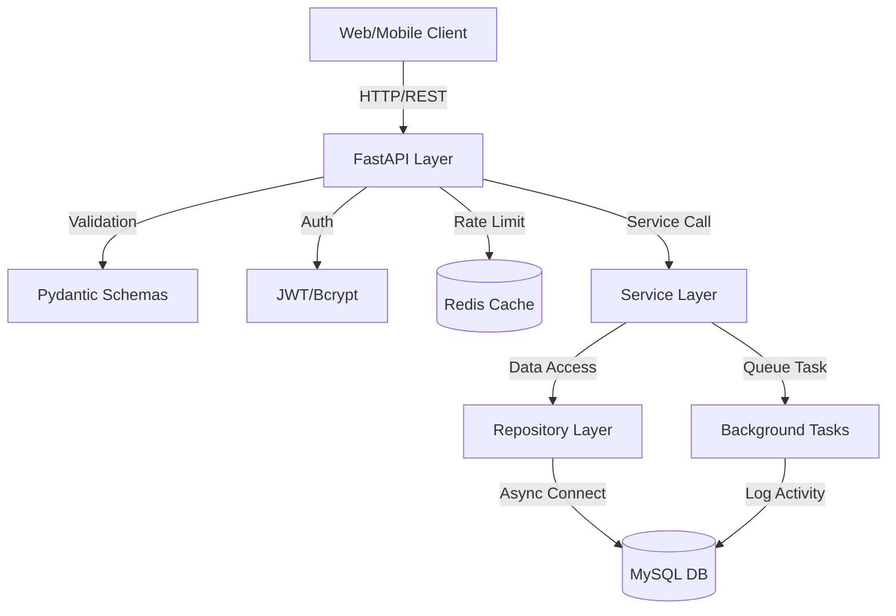
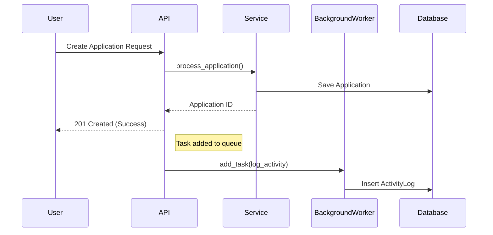
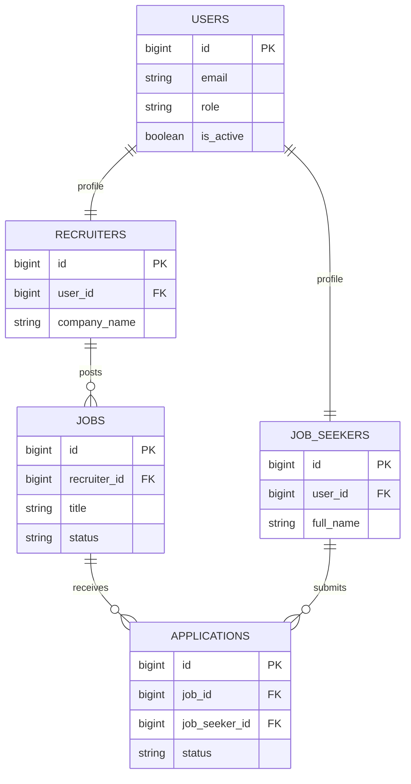

# Job Portal - Enterprise Python Microservice

This project is an enterprise-grade Job Portal API built with FastAPI, SQLAlchemy 2.0 (Async), and Alembic. It features a microservice-oriented architecture, Redis-based caching, and robust JWT authentication.

---

## 📋 Table of Contents
1. [Local Installation](#-local-installation)
2. [Service Architecture](#-service-architecture)
3. [System Diagrams](#-system-diagrams)
4. [Microservices Documentation](#-microservices-documentation)
5. [Service Integration](#-service-integration)
6. [Redis & Performance](#-redis--performance)
7. [Authentication Guide](#-authentication-guide)
8. [Command Cheat Sheet](#-command-cheat-sheet)
9. [How-To: Create a Job](#-how-to-create-a-job)

---

## 🚀 Local Installation

### 1. Database Setup
Ensure you have **MySQL** running on your host machine.
- **MySQL**: Create a database named `job_portal`.

### 2. Environment Configuration
Create a `.env` file in the root directory:
```env
MYSQL_USER=root
MYSQL_PASSWORD=0451
MYSQL_SERVER=localhost
MYSQL_PORT=3306
MYSQL_DB=job_portal
SECRET_KEY=yoursecretkey_changeme_in_production
ALGORITHM=HS256
ACCESS_TOKEN_EXPIRE_MINUTES=10080
```

### 3. Python Environment Setup
```bash
# Create virtual environment
python -m venv venv

# Activate virtual environment
# On Windows:
venv\Scripts\activate
# On Linux/macOS:
source venv/bin/activate

# Install dependencies
pip install -r requirements.txt
```

### 4. Database Migrations
Initialize the database schema using Alembic:
```bash
# Apply migrations to the database
alembic upgrade head
```

### 5. Seed Initial Data
Populate the database with the mandatory test data:
```bash
python seed.py
```

### 6. Run the Application
Start the FastAPI server:
```bash
uvicorn main:app --reload
```
The API will be available at: `http://localhost:8000`
Documentation: `http://localhost:8000/docs`

### 7. Testing
Run the asynchronous test suite:
```bash
pytest
```

---

## 🏗️ Service Architecture

### 1. Overview
The Job Portal API is an enterprise-grade microservice built with FastAPI, following a layered architecture pattern. It emphasizes asynchronous processing, scalability, and robust security.

### 2. Core Components
- **API Layer (FastAPI)**: Handles HTTP requests, validation (Pydantic), and response formatting.
- **Service Layer**: Orchestrates business logic and integrates background tasks.
- **Repository Layer (SQLAlchemy)**: Manages data access and persistence with async support.
- **Database (MySQL)**: Primary relational storage.
- **Background Jobs (AsyncIO)**: Processes non-blocking tasks like activity logging and notifications.

### 3. Design Principles
- **SOLID**: Decoupled components via Repository pattern.
- **Statelessness**: JWT-based authentication for horizontal scaling.
- **Async-First**: All I/O operations (DB, API calls) are non-blocking.
- **Resilience**: Centralized exception handling and connection pooling.

### 4. Async & Background Task Flow
1. API request enters.
2. Logic processed in service/repository.
3. Response returned immediately to user.
4. `BackgroundTasks` triggered for logging/notifications without blocking the response.

### 5. Database Schema
- **Users**: Authentication and role-based access.
- **Job Seekers/Recruiters**: Profile details linked to Users.
- **Jobs**: Postings with skill requirements.
- **Applications/Interviews**: Lifecycle management of job discovery.
- **Activity Logs**: Audit trail for system actions.

---

## 📊 System Diagrams

### 1. Service Architecture


### 2. Async & Background Task Flow


### 3. Database ER Diagram


---

## 🧩 Microservices Documentation

### 1. Authentication Service (`auth_service`)
- **Key Operations**: User authentication, JWT generation, registration, RBAC.
- **Dependencies**: User repository, Security utilities.

### 2. Job Service (`job_service`)
- **Key Operations**: Postings, search/filter, status updates, analytics.
- **Dependencies**: Job repository.

### 3. Profile Service (`profile_service`)
- **Key Operations**: Job seeker/recruiter profile management, ownership verification.
- **Dependencies**: JobSeeker/Recruiter repositories.

### 4. Application Service (`application_service`)
- **Key Operations**: Submission, status updates, duplicate prevention.
- **Dependencies**: Application repository, Notification service.

### 5. Notification Service (`notification_service`)
- **Key Operations**: Confirmation emails, interview invitations, status updates, alerts.
- **Dependencies**: Logger, Extension-ready for email.

---

## 🔗 Service Integration

### Mapping Overview
- **Auth**: `POST /api/v1/auth/login/access-token` -> `auth_service.authenticate_user()`
- **Jobs**: `POST /api/v1/jobs/` -> `job_service.create_job_posting()`
- **Profiles**: `POST /api/v1/profiles/recruiters` -> `profile_service.create_recruiter_profile()`
- **Applications**: `POST /api/v1/applications/` -> `application_service.submit_application()`

### Communication Flow
User Request -> API Endpoint -> Service Layer -> Repository Layer -> Database -> Background Tasks.

---

## ⚡ Redis & Performance

### 1. Caching Strategy
- **Active Job Stats**: Cached for 10 minutes (`jobs:count:active`).
- **Search Results**: Multi-key pattern caching (`jobs:search:*`).
- **Rate Limiting**: IP-based counter (`rate_limit:{ip}`) at 60 req/min.

### 2. Benefits
- 80% reduction in database queries for analytics.
- <5ms response latency for cached endpoints.
- DDoS protection via rate limiting.

### 3. Manual Management
```python
from app.core.redis import redis_cache
await redis_cache.clear_cache() # Clears all
```

---

## 🔐 Authentication Guide

### 1. Flow
1. **Register**: `POST /api/v1/auth/register`
2. **Login**: `POST /api/v1/auth/login/access-token` (Returns JWT)
3. **Access**: Include `Authorization: Bearer <token>` in headers.

### 2. Security Features
- **Algorithm**: HS256
- **Expiration**: 7 days
- **Hashing**: Bcrypt

---

## 🚀 Command Cheat Sheet

### **Run Server**
```bash
python -m uvicorn main:app --host 127.0.0.1 --port 8080 --reload
```

### **Database**
```bash
alembic upgrade head # Apply migrations
alembic revision --autogenerate -m "msg" # Create migration
python seed.py # Seed data
```

### **Testing (PowerShell)**
```powershell
# Get Token
$response = Invoke-RestMethod -Uri "http://127.0.0.1:8080/api/v1/auth/login/access-token" -Method POST -ContentType "application/x-www-form-urlencoded" -Body "username=test@example.com&password=password123"
$token = $response.access_token

# Access Protected
Invoke-RestMethod -Uri "http://127.0.0.1:8080/api/v1/users/me" -Method GET -Headers @{"Authorization"="Bearer $token"}
```

---

## 📝 How to Create a Job

### Using Swagger UI (Recommended)
1. Open `http://127.0.0.1:8080/docs`
2. Click **🔒 Authorize** and enter credentials.
3. Find `POST /api/v1/jobs/`, click **Try it out**, fill body, and **Execute**.

### Using cURL
```bash
curl -X POST "http://127.0.0.1:8080/api/v1/jobs/" \
  -H "Authorization: Bearer YOUR_TOKEN" \
  -H "Content-Type: application/json" \
  -d '{"title":"DevOps Engineer","description":"Remote","location":"Bangalore","salary_min":60000,"salary_max":90000,"job_type":"FULL_TIME","status":"OPEN","recruiter_id":1,"skill_ids":[1,2]}'
```
